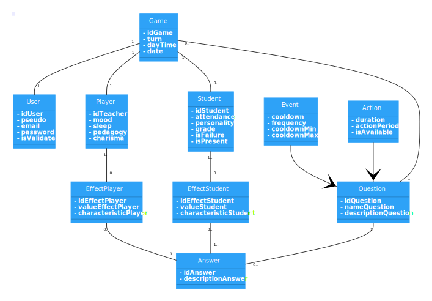

# Symfony-project : ConfinementClassroom

## Project presentation :

### Project Kanban :
[Click here](https://github.com/Zerui-WANG/Symfony-project/projects/1) to go to the project Kanban

### Presentation slides :
[Click here](https://github.com/Zerui-WANG/Symfony-project/blob/develop/presentation_slides.pdf) to see the slides

## Requirements :

### SQL file :

### Accounts to connect on the website :

### System : 
- PHP 7.2 (and above)

### App : 
- Symfony
- Bootstrap
- Twig
- ORM Doctrine
- Composer
- GitHub
- wamp/xamp

## Get started
- `symfony server:start -d`
- open a web development environment (such as wamp)
- `symfony console doctrine:migration:migrate`
- `symfony console doctrine:fixtures:load`
- `symfony console app:students-name-load`

images libres de droits et licences:

© Stocklib / Laura Milena Guzman Lopez
-badGrade.jpg
-mediumgrade.jpg
-goodGrade.jpg
