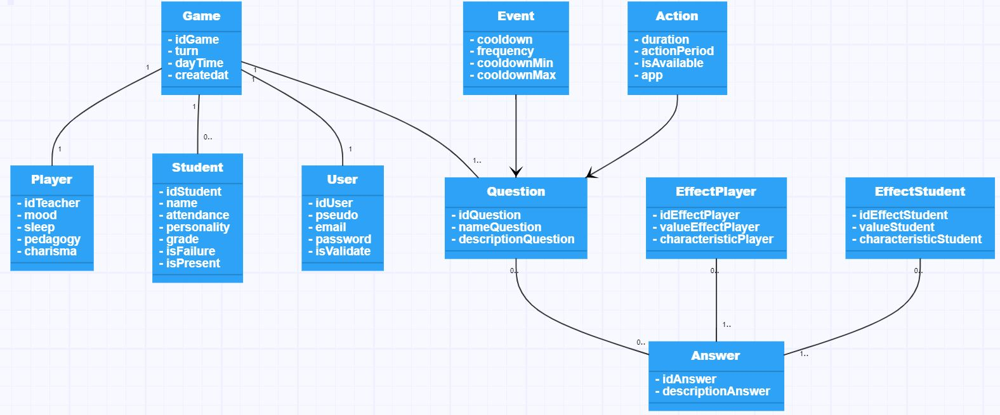

# Symfony-project : ConfinementClassroom

## Project :
[Click here](http://magma-game.com/ConfinementClassroom/public/) to see the website online

## Project presentation :

### Project Kanban :
[Click here](https://github.com/Zerui-WANG/Symfony-project/projects/1) to go to the project Kanban.
### Presentation slides :
[Click here](https://github.com/Zerui-WANG/Symfony-project/blob/develop/presentation_slides.pdf) to see the slides.
## Requirements :
### SQL file :
[Click here](https://github.com/Zerui-WANG/Symfony-project/blob/main/confinementclassroom%20(1).sql) to see the sql file.
### Accounts to connect on the website :
Username : admin@admin.ad   
password : password
### System : 
- PHP 7.2 (and above)
### App : 
- Symfony
- Bootstrap
- Twig
- ORM Doctrine
- Composer
- GitHub
- wamp/xamp
## Get started
- `symfony server:start -d`
- Open a web development environment such as Wamp
- Do `php bin/console d:f:l`
- Database is filled : the questions in the table question has the same game_id => these questions are the question templates
- In config/services.yaml : 
    - set $template_game_id to the same value than game_id in the table question 
- If you want to access to an admin account, you should add ["ROLE_ADMIN"] into the database on role column of your user account
    - an account has been created : 
      login : admin@admin.ad  password : password

images libres de droits et licences:
© Stocklib / Laura Milena Guzman Lopez
-badGrade.jpg
-mediumgrade.jpg
-goodGrade.jpg
